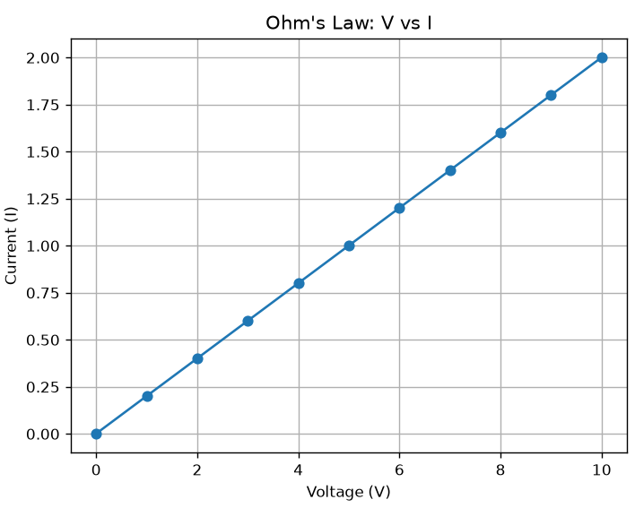

# ⚡ Ohm’s Law Visualizer

A simple Python project that demonstrates **Ohm’s Law (V = IR)** using computation and data visualization with **Matplotlib**.

---

## 📊 Features
- Takes user input for Voltage and Resistance
- Calculates Current using Ohm’s Law
- Plots Voltage vs Current graph
- Visualizes linear relationship in electrical circuits

---

## 🔧 Formula Used
V = I × R  
I = V / R  

---

## 💻 Technologies Used
- Python 🐍
- Matplotlib 📊

---

## 🚀 Purpose of Project

This project is built for learning and understanding:

- Basic electrical engineering concepts

- Python programming

- Data visualization using Matplotlib

---

## 📷 Output Screenshot



---

## Author
- vanshika
- EE(CS)

--  
## 🚀 How to Run
```bash
py ohms_law_visualizer.py

